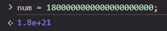

# Number
Number es un tipo de dato que representa números en JavaScript.

# Número Máximo
El número máximo que puede almacenar un number es 1.7976931348623157e+308, es decir, 18 quintillion.


Cuando el número supera este valor, usa esta notación 1.8e+21 usando la **e** de exponente.

$1.8 \times 10^{21}$

Sin embargo, este valor todavía puede ser almacenado sin perder precisión. Pero debido a los 64 bits que maneja al superar el valor máximo seguro los valores comienzan a perder precisión.

Este es el valor máximo y mínimo que puede almacenar un Number sin perder precisión.
```js

Number.MAX_SAFE_INTEGER
9007199254740991

Number.MIN_SAFE_INTEGER
-9007199254740991
```